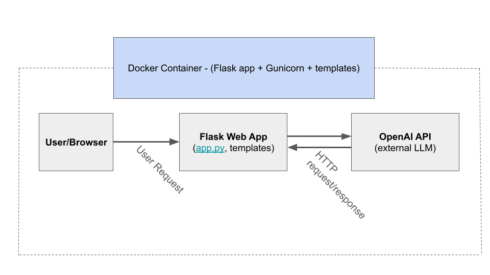
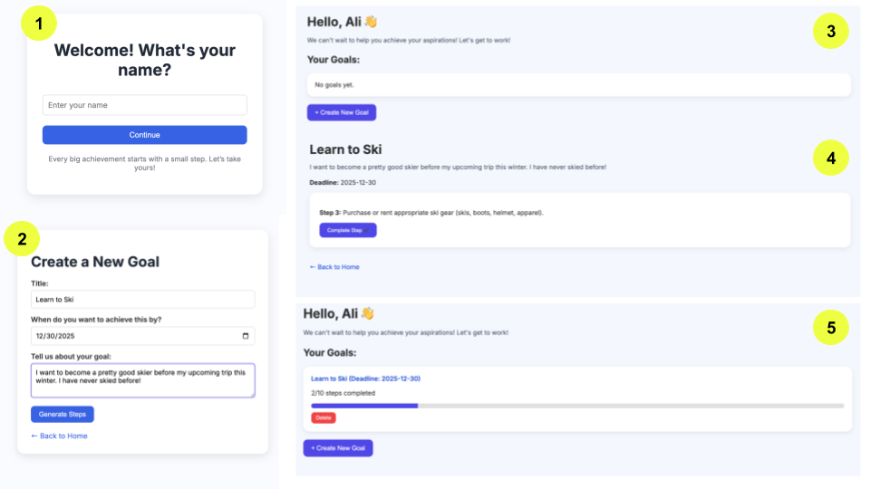

# Goals Tracker

Public URL: https://goals-tracker-sxcd.onrender.com

**A modern, interactive web app for setting, tracking, and completing personal goals with AI-generated step-by-step plans.**

Goals Tracker is a simple and user-friendly web app that helps anyone set personal goals, generate AI-powered step-by-step action plans, and track progress visually. Using OpenAI’s GPT API, the app creates actionable tasks and lets users check off steps as they complete them. When you open the app, you enter your name and are taken to a clean dashboard where you can create, track, complete, and delete your goals, all within a modern, motivating interface.

---

## System Overview

### Features

- **Onboarding flow**: Personalize the app with your name.
- **Goal creation**: Input goal title, description, and deadline.
- **AI-generated steps**: Automatically generate actionable steps using OpenAI GPT models.
- **Step tracker**: Complete steps one by one with the next step automatically displayed.
- **Progress bar**: Track overall goal completion on the home page.
- **Delete goals**: Remove goals if no longer needed.
- **Celebration**: Confetti animation when all steps for a goal are completed.
- **Session-based storage**: Keep track of goals and progress without a database for quick prototyping.
- **Modern UI**: Clean, colorful, professional interface with responsive forms and buttons.

### Course Concepts

* The project uses Flask to create a web service with multiple routes (`/`, `/home`, `/create_goal`, `/goal/<id>`).
* The app and API send and receive information back and forth formatted as JSON.
* It uses environment variables via .env and to securely load the OpenAI API key.
* This demonstrates proper secret management, and the repo includes a .env.example file with placeholder variables.
* This project contains a working Dockerfile, and can run via Docker.
* `requirements.txt` makes for reproducible, easy installation.

### Architecture Diagram



### Models and Services

**Model**

This project uses a large language model (LLM) through the OpenAI API:
* Model: gpt-4o-mini
* Purpose: Generate goal steps in structured JSON
* Size: Remotely hosted model (not stored locally)
* License: OpenAI API (commercial license usage)
No machine-learning model files (.pkl, .onnx, etc.) are stored in the repository.

**Services**

| Component / Service           | Description                                      | License / Terms              |
|------------------------------|--------------------------------------------------|------------------------------|
| **Flask**                    | Web framework used for routing + session logic   | BSD-3 License                |
| **HTML Templates (Frontend)**| Renders onboarding, home, and goal detail pages  | Original (Author-Created)    |
| **OpenAI API**               | Generates step-by-step goal plans using LLM      | OpenAI API Terms of Use      |
| **openai-python library**    | Python client for calling the OpenAI API         | MIT License                  |
| **python-dotenv**            | Loads environment variables from `.env`          | MIT License                  |
| **Gunicorn**                 | Production WSGI server for deployment            | MIT License                  |
| **Docker** (optional credit) | Containerization of the application              | Apache License 2.0           |

---

## How to Run (Local)

1. **Clone the Repository**  
```bash
git clone https://github.com/your-username/Goals-Tracker.git
cd Goals-Tracker
```
2. **Create Virtual Enviornment**
```bash
python -m venv venv
source venv/bin/activate   # Linux/macOS
# OR
venv\Scripts\activate      # Windows
```
3. **Install Dependencies**
```bash
pip install -r requirements.txt
```
4. **Add OpenAI API Key**
Create a `.env` file in the root directory with the following content:
```ini
OPENAI_API_KEY=your_openai_api_key_here
```
5. **Build the App**
```bash
docker build -t goal_app .
```
6. **Finish**
```bash
docker run -p 5000:5000 -e OPENAI_API_KEY=<your-key-here> goal_app
```
Or this works too if you want a more direct way...
```bash
docker run -p 5000:5000 --env-file .env goal_app
```

Open your browser at `http://127.0.0.1:5000` to start using the app.

---

## Design Decisions

### Why this concept?
I recently had been stuck feeling unproductive, so I decided to take this opportunity to build a web app that could actually help my current situation. I thought about a lot of different concepts that could accomplish this, such as a platform that sends reminders to people, or a voice-interactive chat bot that would give advice, but I settled on my current idea instead. I decided that a web app that lets users specify what they want to accomplish and track goal progress in real time would be the most helpful model for my situation. The other ideas I had seemed either less interactive or less visual, so I deemed them less effective at solving the issue at hand. 

### Trade-offs
This web app performs relatively quickly and does a great job at giving the user direct steps to their goals. The site is modern, easy to use, and actually offers real-world functionality. Since I used one of OpenAI's newer models, I did end up paying a little (under 5 cents for 100+ requests) for their service, however, I think this was worth it, because of the quality responses. As of now, this web app does not save goals or other information if the user is to close the app, nor does it have any sort of central database able to create seperate and specific accounts with saved memory per user. This would be a really cool thing to add in the future, to help scale the web app so that others can effectivley use it in their daily lives, but would require a lot of security integration. Overall, the current app is very easy to maintain at a low cost, however extending it to the general public would present the need for a storage and security update, as well as making users pay to use the app to cover request costs. 

### Security/Privacy
The app is designed to run entirely locally on your computer, so no user information is sent to external servers or stored centrally. All data exists only in the browser session while the app is open, and once the app is closed, any entered goals or information are erased, with no way to log back in or recover data. Since there are no usernames, emails, passwords, or any personally identifiable information, user privacy is fully preserved by design. This local-only architecture ensures that sensitive content, including goal data, never leaves the user’s device.

### Operations
The app runs entirely locally on a user’s device, so no specific requests or user data are stored. However, overall usage can be monitored via the OpenAI platform, as each API key tracks the number of requests sent, allowing the developer to see aggregate usage without accessing any personal information. Since the app is local-only, scaling is not a concern in its current form, but if the app were extended to support multiple users, a central database, authentication, and additional security measures would be required to handle concurrent access and persistent storage. Known limitations include the ephemeral nature of all data; once the app is closed, goals are lost, and dependency on the OpenAI API, which requires an active internet connection and may introduce latency or rate limits.

---

## Usage/Results and Evaluation

### Onboarding
Enter your name to personalize your dashboard.

### Create a Goal
Fill in the title, description, and deadline. Click **Generate Steps** to get AI-suggested tasks.

### Complete Steps
Go to the goal page and complete tasks one by one. Completed steps are tracked in the **progress bar** on the home page.

### Delete Goals
Use the red **Delete** button on the home page to remove any unwanted goals.



Overall, I think that the app turned out really well, and was a success. As you can see in the image, the design is easy to use and pleasnant to look at, while still functional and able to solve real-world problems. The app, when launched from the link, may take a moment to load, but after that is fully functional at moderate to high speeds. To test the app, I gave the system several of my own inputs and explored all the features of the site, to make sure that it all performed as expected. I also had other people on different devices open the app and try it for themselves, to be sure that user sessions didn't accidentally overlap information, and to make sure it was fully user-friendly. 

---

## Next Steps

- **Persistent Storage**  
  Integrate a database (SQLite/PostgreSQL) for permanent goal tracking.

- **User Authentication**  
  Add login/signup functionality for multiple users.

- **Enhanced UI**  
  Add color-coded step statuses, animations, and mobile responsiveness.

- **Notifications**  
  Implement email or browser notifications for deadlines.

- **Analytics**  
  Track progress trends over time.

---

## Links

**GitHub Repository** - https://github.com/alibpowell/Goals-Tracker

**Public URL** - https://goals-tracker-sxcd.onrender.com/

---

## Liscence and Credits

### Credits

Flask (BSD License) — web framework

OpenAI API + openai-python library — used for AI step generation

Gunicorn — production web server

Python 3.14

Render.com — hosting platform

### Liscense

**OpenAI API (commercial license usage)**

**MIT License**

Copyright (c) 2025 Ali

Permission is hereby granted, free of charge, to any person obtaining a copy
of this software and associated documentation files (the "Software"), to deal
in the Software without restriction, including without limitation the rights
to use, copy, modify, merge, publish, distribute, sublicense, and/or sell
copies of the Software, and to permit persons to whom the Software is
furnished to do so, subject to the following conditions:

The above copyright notice and this permission notice shall be included in all
copies or substantial portions of the Software.

THE SOFTWARE IS PROVIDED "AS IS", WITHOUT WARRANTY OF ANY KIND, EXPRESS OR
IMPLIED, INCLUDING BUT NOT LIMITED TO THE WARRANTIES OF MERCHANTABILITY,
FITNESS FOR A PARTICULAR PURPOSE AND NONINFRINGEMENT. IN NO EVENT SHALL THE
AUTHORS OR COPYRIGHT HOLDERS BE LIABLE FOR ANY CLAIM, DAMAGES OR OTHER
LIABILITY, WHETHER IN AN ACTION OF CONTRACT, TORT OR OTHERWISE, ARISING FROM,
OUT OF OR IN CONNECTION WITH THE SOFTWARE OR THE USE OR OTHER DEALINGS IN THE
SOFTWARE.

